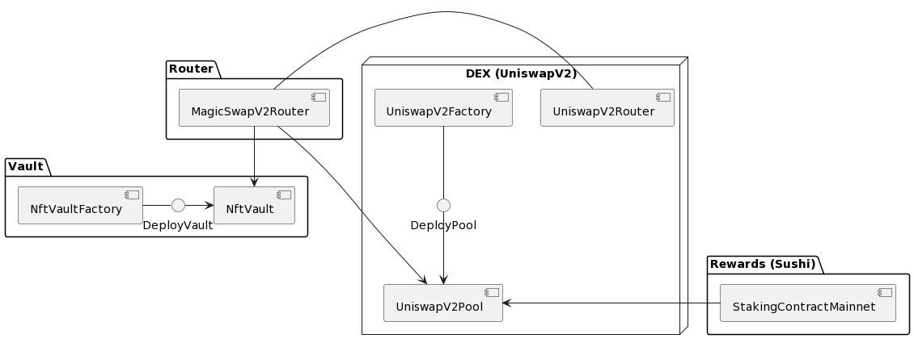

# Magicswap v2

> A novel permissionless AMM with universal token compatibility tailored for games.

Magicswap is a permissionless AMM that provides universal token compatibility and allows users to pool any kind of NFT together and trade them like you would on AMMs like Uniswap. Users never touch underlying vault tokens, and handle only NFTs directly, simplifying the whole experience. Users can create pools for any combination of ERC-20s, ERC-721s, and ERC-1155s. Pools can include multiple vault token types and are compatible with new token standards in the future.

Magicswap is intended to be complementary to protocols like Sudoswap, which are more optimal for trading ERC-721s and low-supply tokenIds of an ERC1155. Magicswap emphasizes a single pool designed for game economies with diverse items as well as new kinds of highly-liquid NFTs that function like currency.

We expect most games to utilize Magicswap through the game engine (what we’re calling a GEX – a Game Exchange). Similar to the Uniswap front-end, game makers will have the freedom to make opinionated decisions about the ways in which things can be traded.

## Features
### Universal NFT Support
Magicswap v2 handles any combination of ERC-721s, ERC-1155s, ERC-20s and simplifies the user experience for both the pool creators and traders. The pool creator first creates and deposits ERC-721s, ERC-1155s, ERC-20s into a vault, then creates a trading pool for them. When users trade out of the AMM, they never interact with the vault and only handle actual NFTs.

### NFT-NFT pools
These pools are technically ERC-20-ERC-20 given that Magicswap pools hold vault tokens. However, the same UX applies in which the user is transacting into the pools in discrete units of an NFT. These pools require an extremely high denominator for the base pair to be feasible. The ideal base pair is an ERC-1155 with a very high token supply, more akin to a memecoin supply than a 10k collection.

The user leaves remainders of each trade in the pool as an additional fee to liquidity providers.

### Ghost Minting
ERC-721s designed to conform with Magicswap vaults are ghost minted to the user when they buy from an AMM, meaning the user can purchase any number of ERC-721s from the same collection at the same cost of transferring one tokenId of an ERC-1155. (The same is not true for selling in which the user must pay to transfer each ERC-721 into the pool.)

Magicswap is not ideal for low-supply ERC-721s so this feature is most useful when the vault is used separately from the AMM. Initial use cases would be reducing gas costs for long-term collectors who tend to buy in large quantities when they make targeted buys from the vault.

ERC-721A (created by Azuki) makes it possible for the user to mint a sequence of tokenIds for lower gas costs during initial mint. Magicswap vaults extend this feature further to whenever NFTs are purchased from the vault.

### LP Rewards (Forthcoming)
The pool creator will be able to issue LP rewards in up to 20 tokens, including ERC-721s and ERC-1155s. The LP can withdraw these additional token rewards as NFTs or vault tokens. Similarly, LP positions can be removed with only partial NFTs.

## Architecture Overview

In Magicswap v2, each pool has its own contract instance, and NFT pools have an associated NftVault which handles all the underlying implementation details around fractionalization.

Magicswap v2 is built with following independent modules:
- NftVault
- DEX
- Router
- Rewards



### NftVault
NftVault wraps NFTs (ERC-721 and ERC-1155) into a ERC-20 representation. There can be an unlimited amount of vaults with varying configurations. One can deploy a vanilla vault for a single ERC-721 collection, or a more complex vault that contains multiple collections with a curated list of allowed tokens. Every vault redeems a NFT for a single ERC-20, e.g. 1 NFT = 1 ERC-20.

### DEX
DEX is a UniswapV2 modified fork with support of custom LP fees, volume based royalties and UniswapV3 style oracle. This allows for smooth NFT/ERC-20 and NFT/NFT trading with real-time automated royalties payments. Each trading pair has a secure decentralized on-chain oracle implemented which opens doors for safe NFT lending at scale.

### Router
Router contract is based on Uniswap's router and its main purpose is to streamline NFT operations within the DEX. Liquidity providing/removal and NFT/ERC-20 and NFT/NFT swaps to name a few. Users can swap between multiple ERC-721/ERC-1155/ERC-20 tokens within a single transaction.

### Rewards
Rewards is a fork of Sushi Staking Rewards contract that allows staking of LP tokens to earn multiple reward tokens at the same time.

## Test

```
forge test -vvv
```

## Deploy

- Setup `PRIVATE_KEY` var in `.env` using deployer's private key.
- Setup `ARBITRUM_RPC` var in `.env` using Arbitrum RPC url.
- Setup `ARBITRUM_SEPOLIA_RPC` var in `.env` using Arbitrum Sepolia RPC url (for testnet deployment).
- Setup `ARBISCAN_API_KEY` var in `.env` using Arbitrum RPC url (for contract source verification).

Then, run deployment script.

For Arbitrum mainnet:

```sh
sh ./sh/deployArbitrum.sh
```

For Arbitrum Sepolia testnet:

```sh
sh ./sh/deployArbitrumSepolia.sh
```

To deploy and verify Staking Contracts run

```sh
forge script script/StakingContract.s.sol:StakingContractScript --rpc-url $ARBITRUM_RPC --broadcast --verify -vvvv
```

To simulate deployment (dry run), remove `--broadcast` option.

# Disclaimer
These smart contracts and code are being provided as is. No guarantee, representation or warranty is being made, express or implied, as to the safety or correctness of the user interface or the smart contracts and code. There can be no assurance they will work as intended, and users may experience delays, failures, errors, omissions or loss of transmitted information. In addition, using these smart contracts and code should be conducted in accordance with applicable law. Nothing in this repo should be construed as investment advice or legal advice for any particular facts or circumstances and is not meant to replace competent counsel. It is strongly advised for you to contact a reputable attorney in your jurisdiction for any questions or concerns with respect thereto. Treasure is not liable for any use of the foregoing and users should proceed with caution and use at their own risk.
