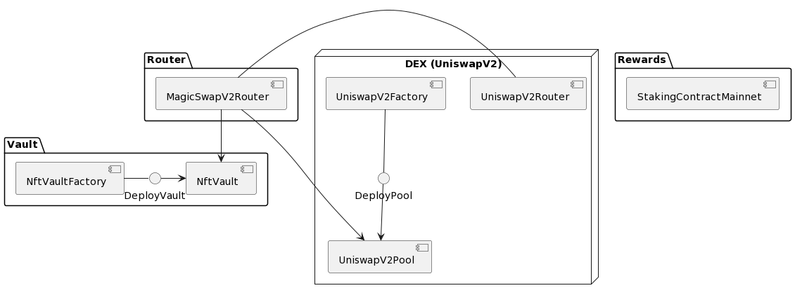

# MagicSwapV2
> NFTX meets UniswapV2 meets UniswapV3 TWAP aka **MagicSwapV2**.

### MagicSwapV2 is a permissionless DEX for NFTs with automated royalties and decentralized NFT TWAP oracle.

MagicSwapV2 is built with following independent modules:
- Vault
- DEX
- Router
- Rewards



#### Vault
Vault is wrapping NFTs (ERC721 & ERC1155) into ERC20. There can be unlimited amount of vaults with varying configurations. One can deploy vanilla vault for single ERC721 collection or complex vault for number of collections with curated list of allowed tokens. Every vault redeems a NFT for a single ERC20 aka 1 NFT == 1 ERC20.

#### DEX
DEX is a UniswapV2 modified fork with support of custom LP fees, volume based royalties and UniswapV3 style oracle. This allows for smooth NFT <> ERC20 and NFT <> NFT trading with real-time automated royalties payments. Each trading pair has a secure decentralized on-chain oracle implemented which opens doors for safe NFT lending at scale.

#### Router
Router contract is based on Uniswap's router and its main purpose is to streamline NFT operations within the DEX. Liquidity providing/removal and NFT<>ERC20 and NFT<>NFT swaps to name a few. User can swap between multiple ERC721/ERC1155/ERC20 tokens within single transaction.

#### Rewards
Rewards is a fork of Sushi Staking Rewards contract that allows staking of LP tokens and earning multiple reward tokens at the same time.

## Test
```
forge test -vvv
```

## Deploy
Setup `PRIVATE_KEY` var in `.env` with deployer's private key.
Setup `ARBITRUM_RPC` var in `.env` with Arbitrum RPC url.

Then, to load the variables in the .env file call
```
source .env
```

To deploy and verify MagicSwapV2 contracts run
```
forge script script/MagicswapV2.s.sol:MagicswapV2Script --rpc-url $ARBITRUM_RPC --broadcast --verify -vvvv
```

To deploy and verify Staking Contracts run
```
forge script script/StakingContract.s.sol:StakingContractScript --rpc-url $ARBITRUM_RPC --broadcast --verify -vvvv
```

To simulate deployment (dry run), remove `--broadcast` option from above.


For questions reach out to [@ghoul-sol](https://github.com/ghoul-sol)
